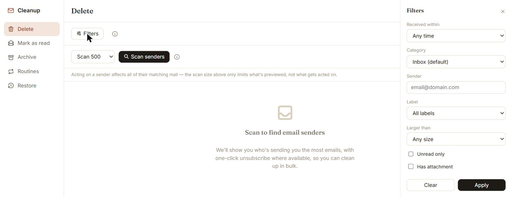
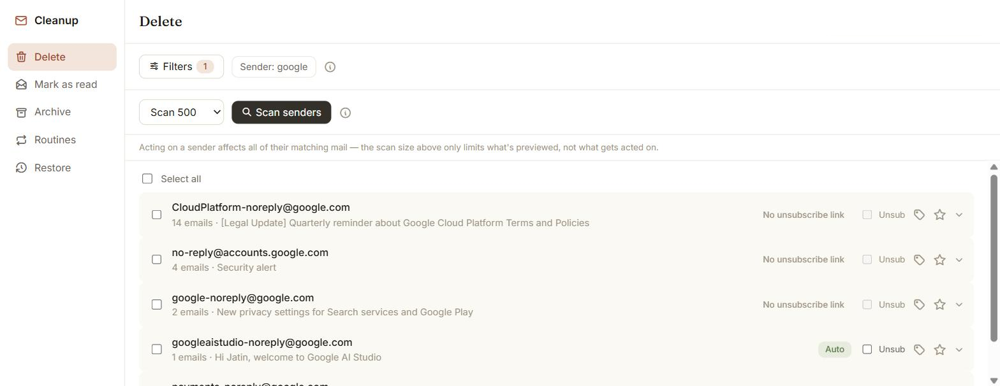
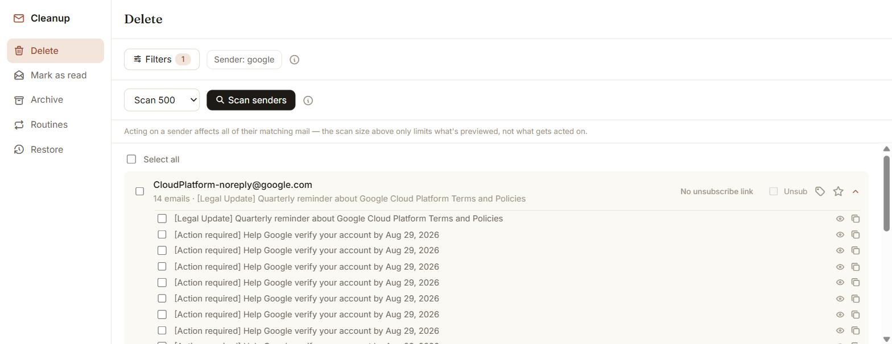
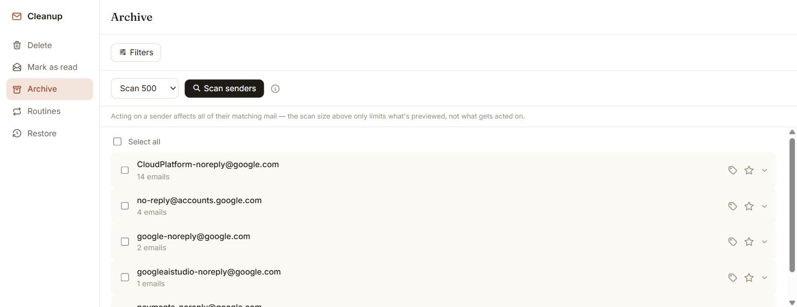
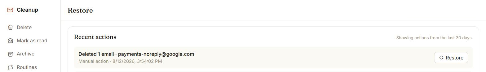
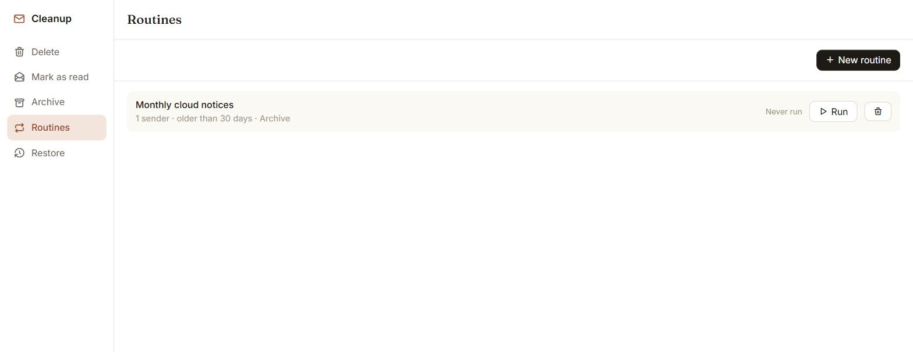
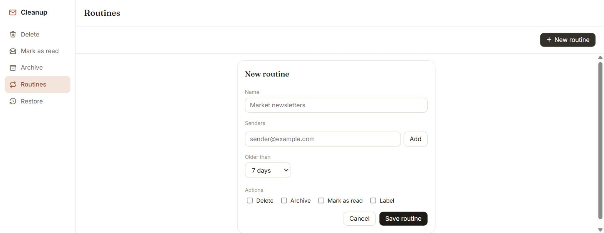

# Gmail Bulk Unsubscribe & Cleanup Tool

A **free**, privacy-focused tool to clean up a messy Gmail inbox — delete, unsubscribe, archive, or mark as read in bulk, by sender. No subscriptions, no data collection, runs 100% on your machine.


> **No Subscription Required - Free Forever**

## Contents

**Overview**
- [Features](#features)
- [Platform Support](#platform-support)
- [Privacy & Security](#privacy--security)

**See it in action**
- [Demo](#demo)
- [Screenshots](#screenshots)

**This fork**
- [This Fork's Roadmap](#this-forks-roadmap)
- [Future Work](#future-work)
- [Architecture](#architecture)

**Get started**
- [Need Help Setting Up?](#need-help-setting-up)
- [Prerequisites](#prerequisites)
- [Setup](#setup)
- [Usage](#usage)
- [Advanced Configuration](#advanced-configuration)
- [Troubleshooting](#troubleshooting)

**More**
- [FAQ](#faq)
- [Feature Requests](#feature-requests)
- [Contributing](#contributing)
- [Credits](#credits)

## Features

**Clean up by sender**
- **Delete** — scan your inbox, see who's filling it up, delete in bulk
- **Unsubscribe** — one-click where Gmail can do it automatically, right on the Delete view
- **Archive** — clear senders out of your inbox without deleting them
- **Mark as read** — bulk-clear unread mail by sender
- **Labels** — create, apply, and remove labels from a sender's mail
- **Mark Important** — mark or unmark a sender's mail as important
- **Download** — export a sender's email metadata as CSV

**Filter and preview before you act**
- **Smart filters** — age, category, size, sender, label, unread-only, has-attachment
- **Per-email preview** — expand any sender to see the actual subject lines, not just a sample, and exclude specific messages before a bulk action runs

**Safety net**
- **Restore** — every delete, archive, mark-as-read, or label action is logged locally and undoable with one click for 30 days — not just whatever's in Gmail's own Trash
- **Quota-aware** — scans and bulk actions pace themselves to stay under Gmail's API limits, with automatic retry on rate limiting

**Automation**
- **Routines** — save a sender list, an age threshold, and one or more actions as a named preset; re-run it anytime with one click, always with a preview first

**Accounts & access**
- **Multi-account** — sign in to more than one Gmail account and switch between them without re-authenticating
- **Optional login gate** — protect the whole app behind a shared password if it's reachable beyond just your own machine

**Privacy**
- **100% local** — your data never leaves your machine
- **Your own credentials** — you control your own Google Cloud OAuth app, not a shared one

## Platform Support

Works on **all major platforms** - both Docker and local installation:

| Platform | Docker | Local (Python) |
|----------|--------|----------------|
| Linux (x86_64) | Native | Native |
| Windows (x86_64) | Native | Native |
| macOS Intel | Native | Native |
| macOS Apple Silicon (M1/M2/M3/M4) | Native | Native |

## Privacy & Security

- **100% Local** - No external servers, no data collection
- **Open Source** - Inspect all the code yourself
- **Minimal Permissions** - Only requests read + modify (for mark as read)
- **Your Credentials** - You control your own Google OAuth app
- **Gitignored Secrets** - `credentials.json` and `token.json` never get committed
- **Optional login gate** - a shared password can protect the whole app if it's reachable beyond localhost

## Demo

> This GIF is from before this fork's UI redesign — it shows an older version of the app (a separate "Unsubscribe" tab, no Archive/Routines/Restore). For what it actually looks like today, see [Screenshots](#screenshots) below.


**[Watch Setup Video on YouTube](https://youtu.be/CmOWn8Tm5ZE)** - Step-by-step video on how to setup the repo and run the project locally.

## Screenshots

The current version, as of this fork. A quick tour, roughly in the order you'd actually use it. (Sender names and account details below are redacted or scrubbed to generic notification senders — nothing personal.)

Filter first if you want to — scope a scan by age, category, sender, size, and a few other things before running it.



Then scan, and see who's actually filling up your inbox. Senders are grouped together, with an unsubscribe badge and quick Label/Important actions right on each row.



Before you commit to anything, you can expand a sender and look at what's actually in there — real subject lines, not a guess. Uncheck anything you want to keep, or open a message straight in Gmail.



Archive and Mark as read work the same way, just with a different end result.

<table>
<tr>
<td></td>
<td></td>
</tr>
</table>

Made a mistake? Undo it. Anything you do through the app is reversible for 30 days.



And if you find yourself doing the same cleanup over and over, save it as a Routine and just hit run next time.

<table>
<tr>
<td></td>
<td></td>
</tr>
</table>

## This Fork's Roadmap

> This reflects what's changed in **this fork** specifically, on top of the upstream project — not upstream's own roadmap. Full detail on every fix, including the back-and-forth bug-hunting along the way, is in [`CHANGELOG.md`](CHANGELOG.md).

| Area | What changed | Status |
|---|---|---|
| Correctness & safety | Delete/label actions now respect active filters, Inbox-scoped by default, an optional login gate, and Gmail API quota pacing with retry/backoff | Done |
| Restore-from-Trash | Every delete/archive/mark-as-read/label action is logged locally and undoable for 30 days | Done |
| UI/UX redesign | New design system, sidebar navigation, a filter drawer, inline Label/Important actions on every row | Done |
| Multi-account switcher | Sign in to multiple accounts, switch between them without re-authenticating | Done |
| Routines | Saved recurring cleanup presets, with a preview before every run | Done |
| Per-email preview | Expand a sender to see and exclude individual messages before a bulk action | Done |

## Future Work

Ideas that came up during development but aren't built — not committed to, just documented so they're not lost. No timeline attached.

- **Edit a saved Routine.** Today you can only create or delete one; changing senders/threshold/actions means deleting and recreating, which loses its run history.
- **Deeper per-sender preview.** Expanding a sender only shows what a scan already fetched — for a sender with far more mail than the scan's limit covered, there's no way to page further into just that one sender's history without rescanning everything at a higher limit.
- **An explicit "scan entire mailbox" mode** with an upfront time estimate, for anyone who wants a full picture rather than the default preview-sized scan.
- **A sender-first search entry point** — when you already know who you want to clean up, search that sender directly instead of scanning broadly first.
- **Restore entries showing what was actually in the emails**, not just a sender + count.
- **Routines re-using Gmail's change-history API** instead of re-scanning a mailbox from scratch on every run, so repeat runs against a mostly-unchanged inbox cost less.

## Architecture

A walkthrough of how OAuth/multi-account sign-in works here, plus a tour of the current backend and frontend, lives in [`ARCHITECTURE.md`](ARCHITECTURE.md) — worth reading before touching the code.

## Need Help Setting Up?

If you'd rather not deal with Docker or Google Cloud Console yourself, the original project's author, [Gururagavendra](https://github.com/Gururagavendra), has offered hands-on 1-on-1 setup help in the past. See the [upstream repository](https://github.com/Gururagavendra/gmail-cleaner) for details.

Questions about this fork specifically — bugs, feature ideas, anything else? Reach out at [jatin.dev.17@gmail.com](mailto:jatin.dev.17@gmail.com).

## Prerequisites

- **Docker**: [Docker Desktop](https://www.docker.com/products/docker-desktop/)
- **Local (Python)**: [Python 3.9+](https://www.python.org/downloads/) and [uv](https://docs.astral.sh/uv/getting-started/installation/)

## Setup

**Important**: You must create your **OWN** Google Cloud credentials. This app doesn't include pre-configured OAuth - that's what makes it privacy-focused! Each user runs their own instance with their own credentials.

### 1. Get Google OAuth Credentials

**Video Tutorial**: [Watch on YouTube](https://youtu.be/CmOWn8Tm5ZE) for a visual walkthrough

1. Go to [Google Cloud Console](https://console.cloud.google.com/)
2. Create a new project (or select existing)
3. Search for **"Gmail API"** and **Enable** it
4. Go to **Google Auth Platform**  → Click **"Get started"**
5. Fill in the wizard:
   - **App Information**: Enter app name (e.g., "Gmail Cleanup"), select your email
   - **Audience**: Select **External**
   - **Contact Information**: Add your email address
   - Click **Create**
6. Go to **Audience** (left sidebar) → Scroll to **Test users**
   - Click **Add Users** → Add your Gmail address → **Save**
7. Go to **Clients** (left sidebar) → **Create Client**
   - Choose the application type based on your setup:

   | Setup | Application Type | Redirect URI |
   |-------|------------------|--------------|
   | **Local/Desktop** (Python with browser) | Desktop app | Not needed |
   | **Docker (localhost)** | Web application | `http://localhost:8767/` |
   | **Docker/Remote Server (public domain)** | Web application | `http://YOUR_PUBLIC_DOMAIN:8767/` |

   > **⚠️ Important**: Redirect URIs must use a **domain name** (e.g., `gmail.example.com`), **NOT an IP address** (e.g., `192.168.1.100`). Google OAuth does not allow IP addresses. If you need to use a server IP, use a [Dynamic DNS service](#custom-domain--reverse-proxy--remote-server) to get a domain name.

   - Name: "Gmail Cleanup" (or anything)
   - Click **Create**
   - Click **Download** (downloads JSON file)
   - Rename the downloaded file to `credentials.json`

> **💡 Which should I choose?**
> - Running locally with Python (`uv run python main.py`)? → **Desktop app**
> - Running with Docker or on a remote server? → **Web application**
>
> **Note**: If using custom port mapping or a custom domain, see [Advanced Configuration](#advanced-configuration) for redirect URI details.

### 2. Clone the Repository

1. Clone the repo:
```bash
git clone https://github.com/Jatin17Solanki/gmail-cleaner.git
```

2. Navigate to the folder:
```bash
cd gmail-cleaner
```

3. Put your `credentials.json` file in the project folder.

### 3. (Optional) Configuration via `.env`

Everything below is optional — skip this if you just want the defaults.

- **Docker**: set any of these in `docker-compose.yml`'s `environment:` block (already has commented-out examples for each).
- **Local (Python)**: copy [`.env.example`](.env.example) to `.env` and fill in what you need — it's loaded automatically, and gitignored so it never gets committed.

| Variable | What it does |
|---|---|
| `APP_PASSWORD` | Gates the whole app — login page, every action — behind a single shared password. Unset = no login screen at all. Recommended if this instance is reachable by anyone other than you. |
| `WEB_AUTH` | Use the manual "copy the OAuth URL from logs" sign-in flow instead of auto-opening a browser tab. Needed for Docker/remote-server setups (already `true` in `docker-compose.yml`); leave unset for local/desktop use. |
| `OAUTH_HOST` | Custom hostname for the OAuth redirect URI — only for a custom domain/remote server. See [Advanced Configuration](#advanced-configuration). |
| `OAUTH_EXTERNAL_PORT` | External port for the OAuth callback if you're mapping Docker ports to something other than 8767. |
| `QUOTA_TRACE_LOGGING` | Debug aid — logs every Gmail API call the quota tracker charges. Off by default, only useful if you're diagnosing scan pacing yourself. |

## Usage

### Option A: Docker (Recommended)

1. Pull and start the container (`docker-compose.yml` uses this fork's own published image, `ghcr.io/jatin17solanki/gmail-cleaner`, by default — see the comments in `docker-compose.yml` for the build-from-source alternative if you're working on the app itself):
```bash
docker compose up -d
```

2. Open the app in your browser:
```
http://localhost:8766
```

3. Click **"Sign In"** button in the web UI

4. Check logs for the OAuth URL (only after clicking Sign In!):
```bash
docker logs $(docker ps -q --filter name=gmail-cleaner)
```

5. Copy the Google OAuth URL from logs, open in browser, and authorize:
   - Choose your Google account
   - "Google hasn't verified this app" → Click **Continue**
     > This warning appears because you created your own OAuth app (not published to Google). This is expected and safe - you control the app!
   - Grant permissions → Click **Continue**
   - Done! You'll see "Authentication flow has completed"

> **🌐 Using a custom domain, remote server, or custom port mapping?** See [Advanced Configuration](#advanced-configuration) for setup instructions.

#### Persisting Authentication (Data Directory)

The `docker-compose.yml` includes a `data` directory volume mount that automatically persists your authentication token.

**How it works:**

- The `./data` directory on your host is mounted to `/app/data` in the container
- When you authenticate, `token.json` is automatically saved to `/app/data/token.json` inside the container
- This file is persisted to `./data/token.json` on your host filesystem
- On subsequent container restarts, your authentication persists automatically

**No manual steps required!**

- ✅ First-time setup: Just run `docker compose up -d` - the `data` directory is created automatically
- ✅ Authentication persists: Your token is saved to `./data/token.json` on the host
- ✅ Container restarts: Your authentication is automatically loaded from the persisted file

**To reset authentication:**

If you need to sign in with a different account or reset authentication:

```bash
# Stop the container
docker compose down

# Remove the token file
rm -f ./data/token.json

# Start again (will prompt for new authentication)
docker compose up -d
```

### Option B: Python (with uv)

```bash
uv sync
uv run python main.py
```

The app opens at http://localhost:8766

Your token, accounts, and app data persist under `./data/` (relative to
wherever you run this from) — the same directory Docker's `data` mount
uses, so both run modes now share one consistent layout.


## Advanced Configuration

### Custom Port Mapping / Docker Port Override

If you're using **custom port mappings** in Docker (e.g., mapping `18766:8766` and `18767:8767`):

1. **Update docker-compose.yml**:

   ```yaml
   services:
     gmail-cleaner:
       ports:
         - "18766:8766"  # Web UI (external:internal)
         - "18767:8767"  # OAuth callback (external:internal)
       environment:
         - WEB_AUTH=true
         - OAUTH_EXTERNAL_PORT=18767  # External port that browser will use
   ```

2. **Update Google Cloud Console** redirect URI:
   - Go to **Clients** → Your OAuth client → **Authorized redirect URIs**
   - Update to: `http://localhost:18767/` (or `http://YOUR_DOMAIN:18767/` if using custom domain)
   - **Note**: Must be a domain name, not an IP address

3. **Restart the container**:

   ```bash
   docker compose down && docker compose up -d
   ```

> **💡 How it works**: The app listens on port 8767 inside the container, but sets the OAuth redirect URI to use port 18767 (the external port). Docker forwards the external port to the internal port.

### Custom Domain / Reverse Proxy / Remote Server

If you're accessing via a **custom domain** (e.g., `gmail.example.com`) instead of `localhost`:

> **⚠️ Important**:
> - Use **Web application** credentials (not Desktop app) for remote server setups. See [Step 7 in Get Google OAuth Credentials](#1-get-google-oauth-credentials).
> - **IP addresses are NOT allowed** in Google OAuth redirect URIs. You must use a domain name (e.g., `gmail.example.com`), not an IP address (e.g., `192.168.1.100`).
> - Google requires redirect URIs to use a public top-level domain (`.com`, `.org`, `.net`, etc.)

**Allowed redirect URIs:**
- ✅ `http://localhost:8767/` (for local access)
- ✅ `http://gmail.example.com:8767/` (custom domain)
- ✅ `http://mygmail.duckdns.org:8767/` (dynamic DNS)
- ❌ `http://192.168.1.100:8767/` (IP addresses not allowed)
- ❌ `http://10.0.0.5:8767/` (private IPs not allowed)

**If you need to use a server IP:**
- Use a **dynamic DNS service** (free options: [DuckDNS](https://www.duckdns.org/), [No-IP](https://www.noip.com/), [Dynu](https://www.dynu.com/))
- Point the domain to your server's IP address
- Use the domain name in OAuth (e.g., `http://mygmail.duckdns.org:8767/`)

1. **Update Google Cloud Console**:
   - Go to **Clients** → Your OAuth client → **Authorized redirect URIs**
   - Add: `http://YOUR_DOMAIN:8767/` (or external port if using custom mapping)
   - **Must be a domain name, not an IP address**

2. **Update docker-compose.yml**:

   ```yaml
   environment:
     - WEB_AUTH=true
     - OAUTH_HOST=gmail.example.com  # Just the hostname - NO http:// or https://
     # Optional: If using custom port mapping
     - OAUTH_EXTERNAL_PORT=18767
   ```

   > **⚠️ Common mistakes**:
   > - Use only the hostname (e.g., `gmail.example.com`), NOT the full URL (e.g., ~~`https://gmail.example.com`~~)
   > - Use a domain name, NOT an IP address (e.g., ~~`192.168.1.100`~~)

3. **For HTTPS with reverse proxy**:
   - The OAuth callback uses HTTP on port 8767 internally
   - Your reverse proxy should forward port 8767 for the OAuth callback
   - The **Authorized redirect URI** in Google Cloud must be `http://YOUR_DOMAIN:8767/` (HTTP, not HTTPS) or use the external port if mapped
   - Proxy both port 8766 (app) and port 8767 (OAuth callback) through your reverse proxy

## Troubleshooting

### OAuth & Authentication Issues

#### "Access blocked: Gmail Cleanup has not completed the Google verification process"

Your app is missing test users in the OAuth setup:

1. Go to [Google Cloud Console](https://console.cloud.google.com/) → Your Project
2. Go to **APIs & Services** → **OAuth consent screen**
3. Scroll down to **Test users**
4. Click **Add Users** and add your Gmail address
5. Try signing in again

> **Why?** Since your app is in "Testing" mode, only emails listed as test users can sign in. This is normal and expected!

#### "Error 403: access_denied"

1. Make sure you created your **own** Google Cloud project and credentials
2. Make sure your email is added as a **Test user**
3. Make sure you downloaded `credentials.json` and placed it in the project folder

#### "Google hasn't verified this app" warning

This is normal for personal OAuth apps! Click **Continue** to proceed.

This warning appears because your app isn't published to Google - which is exactly what we want for privacy!

#### OAuth CSRF Error / State Mismatch

If you see `OAuth error: (mismatching_state) CSRF Warning`:

1. **Stop and clean up:**
   ```bash
   docker compose down
   rm -f ./data/token.json
   ```

2. **Clear browser cookies** for `accounts.google.com` (or use incognito/private window)

3. **Start fresh:**
   ```bash
   docker compose up -d
   ```

4. Copy the OAuth URL from logs and paste in browser

#### Docker: "Where do I find the OAuth URL?"

Check the container logs:

```bash
docker logs $(docker ps -q --filter name=gmail-cleaner)
```

Look for a URL starting with `https://accounts.google.com/o/oauth2/...`

#### "Invalid Redirect: must end with a public top-level domain" or "Invalid Redirect: must use a domain that is a valid top private domain"

This error occurs when you try to use an **IP address** in the redirect URI (e.g., `http://192.168.1.100:8767/`).

**Google OAuth does NOT allow IP addresses** - you must use a domain name.

**Solutions:**

1. **Use localhost** (if accessing from the same machine):
   - Redirect URI: `http://localhost:8767/`
   - Set `OAUTH_HOST=localhost` in docker-compose.yml

2. **Use a domain name** (if you own one):
   - Point your domain to your server's IP (via DNS A record)
   - Redirect URI: `http://gmail.yourdomain.com:8767/`
   - Set `OAUTH_HOST=gmail.yourdomain.com` in docker-compose.yml

3. **Use Dynamic DNS** (free option for home servers):
   - Sign up for a free DDNS service: [DuckDNS](https://www.duckdns.org/), [No-IP](https://www.noip.com/), or [Dynu](https://www.dynu.com/)
   - Get a domain like `mygmail.duckdns.org`
   - Point it to your server's public IP address
   - Redirect URI: `http://mygmail.duckdns.org:8767/`
   - Set `OAUTH_HOST=mygmail.duckdns.org` in docker-compose.yml

**Remember:** The redirect URI in Google Cloud Console must exactly match what you set in `OAUTH_HOST` + port.

**Can't delete or modify files in the `./data` directory?**
Docker containers run as root by default, so files created in `./data` (like `token.json`) are owned by root:
```bash
sudo chown -R $USER:$USER ./data/
```
Or to delete a specific file: `sudo rm ./data/token.json`. This is normal Docker behavior — the files are safe, just root-owned for security reasons.

## FAQ

**Q: Why do I need to create my own Google Cloud project?**
> Because this app accesses your Gmail. By using your own OAuth credentials, you have full control and don't need to trust a third party.

**Q: Is this safe?**
> Yes! The code is open source - you can inspect it. Your emails are processed locally on your machine.

**Q: Can I use this for multiple Gmail accounts?**
> Yes — after signing in, use "Add another account" from the account switcher in the top bar to sign in to more without ever signing out. Switch between them anytime. Each account still needs to be added as a test user in your Google Cloud project.

**Q: Emails went to Trash, can I recover them?**
> Two ways: the app's own **Restore** tab undoes any delete/archive/mark-as-read/label action taken through it, for 30 days, with one click. Or just go to Gmail → Trash directly — deleting here moves mail there like normal, so it's recoverable there too.

**Q: What's the login screen / `APP_PASSWORD` about?**
> A separate layer from Gmail sign-in — an optional shared password that gates the whole app, useful if it's reachable by more than just you. Set the `APP_PASSWORD` environment variable to turn it on; leave it unset and there's no login screen at all.

**Q: Having OAuth authentication issues?**
> Check the [Troubleshooting](#troubleshooting) section for common solutions.

## Feature Requests

Lets make this tool a better one by improving as much as possible, All features are welcome, To request a feature, [open a GitHub issue](https://github.com/Gururagavendra/gmail-cleaner/issues/new).

## Contributing

New to this codebase? Read [Architecture](#architecture) above before diving in. The original pre-build design mockups (placeholder data, may drift slightly from what's shipped) are in [`wireframes/`](wireframes/) if you're comparing an in-progress UI change against the intended design.

PRs welcome! Please read our [Contributing Guidelines](CONTRIBUTING.md) first.

- Report bugs
- Suggest features
- Improve the UI
- Add new functionality

## Credits

This is a fork of [Gururagavendra/gmail-cleaner](https://github.com/Gururagavendra/gmail-cleaner), created and maintained by [Gururagavendra](https://github.com/Gururagavendra). The OAuth flow, Gmail API integration, and original UI are their work — this fork builds on top of that foundation (see [This Fork's Roadmap](#this-forks-roadmap) above for what's changed). If you're looking for the original, actively-maintained project rather than this personal fork, that's where to go.

<p align="center">
  Made to help you escape email hell | have a nice day
</p>
